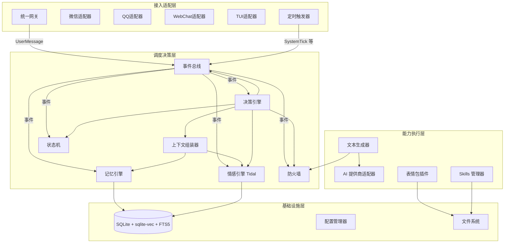
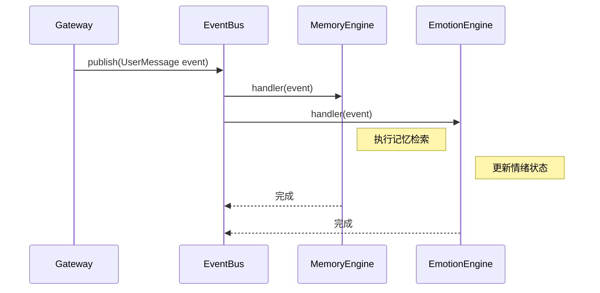
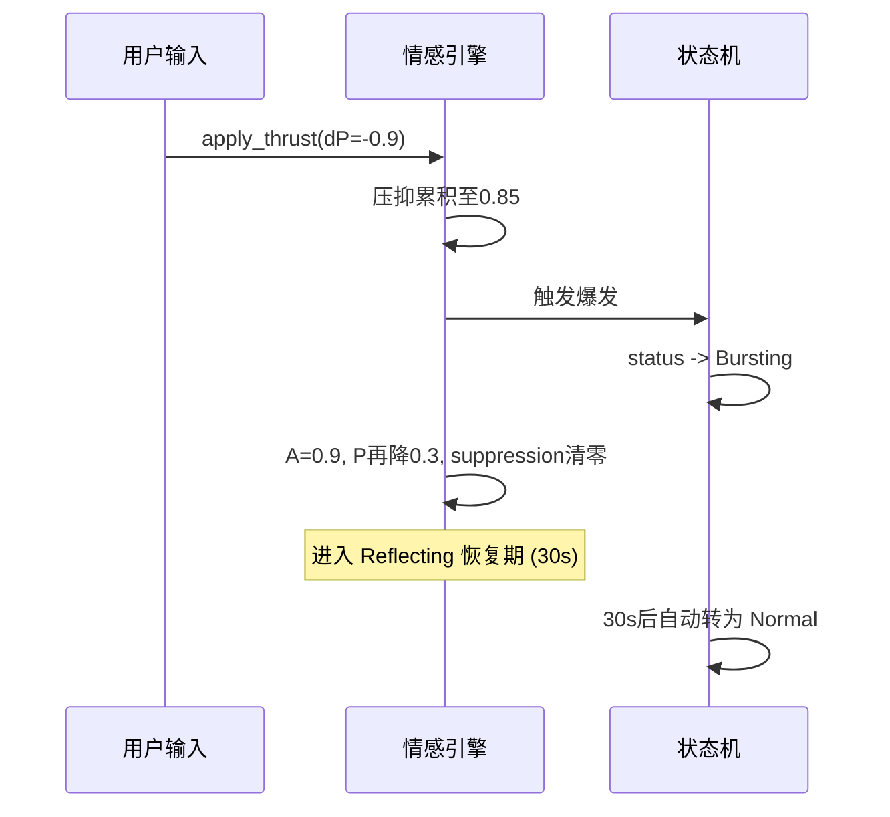
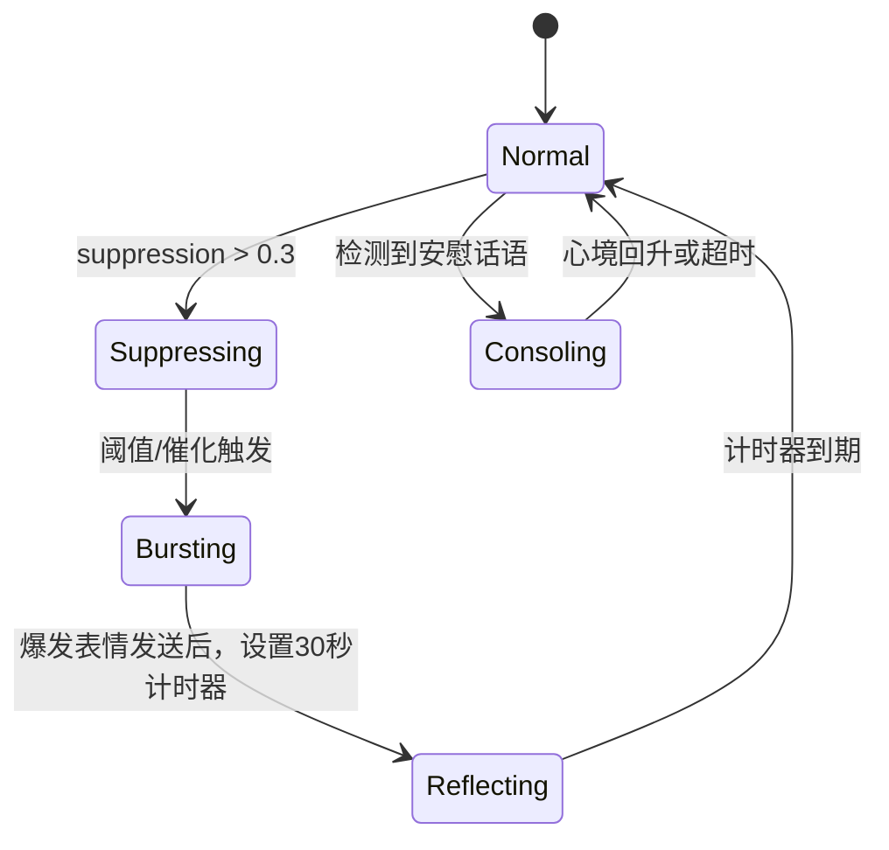
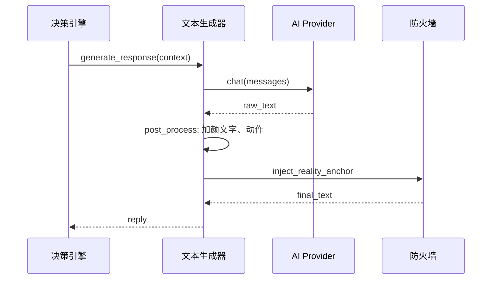

详细设计文档 (LLD)

1. 修订历史

版本 日期 作者 变更摘要
v1.0 2026-06-20 AI 架构师 基于镜核系统设计文档 v5.2 输出初始详细设计

2. 总体设计回顾

2.1 架构图



2.2 技术栈确认

组件 选型 版本/说明
语言 Python 3.12+
异步框架 asyncio 标准库
Web 框架 FastAPI WebChat 及管理API
WebSocket FastAPI 内置 WebChat 实时通信
数据库 SQLite 3.45+ (需支持 vec0 虚拟表)
向量扩展 sqlite-vec v0.1+
全文搜索 FTS5 SQLite 内置
定时调度 apscheduler 4.x
配置管理 PyYAML + pydantic 参数校验与热加载
包管理 PDM / uv 现代 Python 项目管理
测试 pytest + pytest-asyncio 异步测试支持
日志 structlog 结构化 JSON 日志

3. 模块详细设计

3.1 事件总线

3.1.1 职责

提供进程内异步发布/订阅机制，所有模块通过事件类型解耦通信。

3.1.2 接口定义（Python 接口契约）

```python
from typing import Any, Dict, List, Callable, Coroutine
from dataclasses import dataclass, field
from enum import Enum
import asyncio

class EventType(Enum):
    USER_MESSAGE = "user_message"
    SYSTEM_TICK = "system_tick"
    ANNIVERSARY_CHECK = "anniversary_check"
    PROACTIVE_CHANCE = "proactive_chance"
    EMOTION_CHANGED = "emotion_changed"
    STATE_TRANSITION = "state_transition"
    DECISION_ACTION = "decision_action"
    REPLY_READY = "reply_ready"
    ERROR = "error"
    SHUTDOWN = "shutdown"

@dataclass(frozen=True)
class BaseEvent:
    event_id: str           # uuid4, 用于幂等追踪
    type: EventType
    timestamp: float
    source: str             # 模块名
    payload: Dict[str, Any] = field(default_factory=dict)

class EventBus:
    def __init__(self):
        self._subscribers: Dict[EventType, List[Callable[[BaseEvent], Coroutine]]] = {}

    async def publish(self, event: BaseEvent):
        """发布事件，按类型依次通知所有订阅者（顺序执行，保证因果）"""

    def subscribe(self, event_type: EventType, handler: Callable[[BaseEvent], Coroutine]):
        """注册异步处理器"""

    async def shutdown(self):
        """优雅停止：等待所有正在执行的处理器完成"""
```

3.1.3 核心逻辑伪代码

```
async def publish(event):
    handlers = _subscribers.get(event.type, [])
    for handler in handlers:
        try:
            await handler(event)
        except Exception as exc:
            logger.error("事件处理异常", event_type=event.type, handler=handler.__name__, exc_info=exc)
            # 不中断其他处理器

def subscribe(event_type, handler):
    _subscribers.setdefault(event_type, []).append(handler)
```

3.1.4 时序图



3.1.5 非功能设计

· 幂等性：事件 event_id 由生产者生成（UUID4），消费者可记录已处理ID集合，防止重复消费（如从备份日志重放时）。内存记录最近 N 条ID，LRU淘汰。
· 背压控制：publish 为异步循环，若某处理器耗时过长，仅影响该事件类型后续订阅者，不影响其他类型。重要事件（如 USER_MESSAGE）可使用独立 asyncio.Queue 缓冲区，默认不设背压，依赖 SQLite 写入限流。
· 错误处理：处理器异常被捕获记录，不会导致总线停止。致命错误触发 SHUTDOWN 事件。

3.2 接入适配层

3.2.1 统一网关

3.2.1.1 职责
接收各渠道的原始消息，标准化为 UserMessage 事件并发布；监听内部 REPLY_READY 事件，将回复分发至对应渠道适配器。

3.2.1.2 接口定义

```python
@dataclass
class UserMessage:
    platform: str
    platform_user_id: str
    internal_user_id: str        # 从绑定表或配置文件解析
    session_id: str              # 全局唯一会话ID
    text: str
    timestamp: float

class Gateway:
    async def ingress(self, raw_msg: RawMessage) -> BaseEvent: ...
    async def egress(self, target_id: str, content: MessageContent) -> bool: ...
    async def register_adapter(self, adapter: ChannelAdapter): ...
```

3.2.1.3 REST 管理端点（WebChat 扩展）

方法 路径 说明
GET /api/v1/gateway/adapters 返回所有已注册适配器状态
POST /api/v1/gateway/reload 重新加载渠道配置

3.2.1.4 核心逻辑伪代码

```
on_adapter_message(raw):
    internal_id = session_manager.resolve(raw.platform, raw.platform_user_id)
    session_id = session_manager.get_or_create_session(internal_id, raw.platform)
    event = BaseEvent(
        event_id=uuid4(),
        type=EventType.USER_MESSAGE,
        timestamp=time(),
        source="gateway",
        payload={"message": UserMessage(...)}
    )
    await bus.publish(event)
```

3.2.1.5 注意事项

· 会话绑定表采用内存 + SQLite 持久化，重启后恢复。
· 适配器断开后自动重连，重连期间消息缓冲（最多100条）。

3.2.2 渠道适配器标准接口

3.2.2.1 抽象契约

```python
class ChannelAdapter(ABC):
    @abstractmethod
    async def start(self) -> None: ...

    @abstractmethod
    async def send_message(self, target_id: str, content: MessageContent) -> bool: ...

    @property
    @abstractmethod
    def platform_name(self) -> str: ...

@dataclass
class MessageContent:
    text: Optional[str] = None
    image_path: Optional[str] = None       # 本地文件路径
    mime_type: Optional[str] = None
    # 未来扩展：语音、视频等
```

3.2.2.2 具体适配器关键设计

适配器 实现方式 连接细节
微信 (WechatAdapter) 封装 iLink SDK 同步回调转异步，使用 asyncio.to_thread
QQ (QQAdapter) 反向 WebSocket 连接 NapCat aiohttp 客户端，JSON 消息格式
WebChat (WebChatAdapter) FastAPI WebSocket 端点 /ws/{user_id} 浏览器直接连接，JSON {text: ...}
TUI (TuiAdapter) textual 异步事件循环 使用 textual 的 Input 回调发送

3.2.2.3 WebChat 额外 REST API

```json
// GET /api/v1/chat/history?session_id=xxx&limit=20
Response: {
  "messages": [
    {"role": "user", "content": "...", "timestamp": 1234567890},
    {"role": "assistant", "content": "...", "timestamp": 1234567891}
  ]
}
```

3.2.2.4 注意事项

· 所有适配器必须处理 send_message 失败，返回布尔值供网关重试或记录。
· 图片/表情包在非图形渠道（TUI）自动降级为标签文本 [表情: 开心]。

3.2.3 定时触发器

3.2.3.1 职责
生成周期性或条件性事件，驱动主动陪伴和系统维护。

3.2.3.2 接口定义

```python
class Scheduler:
    def __init__(self, bus: EventBus):
        self.scheduler = AsyncIOScheduler()
    def start(self): ...
    def stop(self): ...
```

3.2.3.3 触发任务清单

任务名 触发规则 产生事件
decay_tick 每 60 秒 SystemTick（情感衰减）
anniversary_check 每天 09:00（用户时区） AnniversaryCheck
proactive_chance 每 30~90 分钟随机（quiet_hours除外） ProactiveChance
night_metaphor 23:00-05:00 每 20 分钟检查活跃会话 ProactiveChance (生理隐喻类型)

3.2.3.4 注意事项

· 使用用户配置的时区，若无则用系统时区。
· 随机时间通过 random.uniform 计算，下次执行前重新调度，避免固定周期。

3.3 调度决策层

3.3.1 记忆引擎

3.3.1.1 职责
管理四层记忆的存储、检索、遗忘与合并，提供混合检索接口。

3.3.1.2 接口契约

```python
class MemoryEngine:
    async def retrieve(self, user_id: str, query: str) -> List[EpisodicMemory]: ...
    async def store_episodic(self, memory: EpisodicMemory) -> None: ...
    async def update_fact(self, user_id: str, fact_type: str, key: str, value: Any, confidence: float): ...
    async def get_fact(self, user_id: str, fact_type: str, key: str) -> Optional[FactMemory]: ...
    async def update_semantic(self, user_id: str, relation: str, delta: float): ...
    async def get_semantic(self, user_id: str) -> Dict[str, float]: ...
    async def snapshot_working_memory(self, session_id: str, turns: List[ConversationTurn]): ...
    async def restore_working_memory(self, session_id: str) -> Deque: ...
```

3.3.1.3 数据模型（完整 DDL）

```sql
-- 情景记忆表
CREATE TABLE IF NOT EXISTS episodic_memory (
    id TEXT PRIMARY KEY,
    user_id TEXT NOT NULL,
    session_id TEXT,
    timestamp REAL NOT NULL,
    summary TEXT NOT NULL,
    emotion_json TEXT NOT NULL,   -- JSON: {"P":-0.2,"A":0.5,"D":0.1,"mood":0.1,"suppression":0}
    intensity REAL DEFAULT 0.5,
    tags TEXT DEFAULT '',         -- 逗号分隔标签
    embedding BLOB,               -- 原始向量（可选冗余，用于重建索引）
    fts_content TEXT,             -- 全文搜索文本（summary 拼接 tags）
    created_at REAL DEFAULT (unixepoch())
);

CREATE VIRTUAL TABLE IF NOT EXISTS episodic_fts USING fts5(
    fts_content,
    content='episodic_memory',
    content_rowid='rowid'
);

-- sqlite-vec 向量表 (维度由 embedding_dim 配置决定，默认768)
CREATE VIRTUAL TABLE IF NOT EXISTS episodic_vec USING vec0(
    embedding FLOAT[768]
);

-- 事实记忆表
CREATE TABLE IF NOT EXISTS fact_memory (
    id INTEGER PRIMARY KEY AUTOINCREMENT,
    user_id TEXT NOT NULL,
    fact_type TEXT NOT NULL,       -- 'preference','birthday','milestone','sensitive','custom'
    key TEXT NOT NULL,
    value TEXT NOT NULL,
    confidence REAL DEFAULT 1.0,
    last_updated REAL DEFAULT (unixepoch()),
    UNIQUE(user_id, fact_type, key)
);

CREATE INDEX idx_fact_user ON fact_memory(user_id);

-- 语义记忆表
CREATE TABLE IF NOT EXISTS semantic_memory (
    user_id TEXT PRIMARY KEY,
    trust_score REAL DEFAULT 0.5,
    intimacy_score REAL DEFAULT 0.3,
    relationship_stage TEXT DEFAULT 'acquaintance',  -- acquaintance, friend, close, soulmate
    last_updated REAL DEFAULT (unixepoch())
);

-- 对话轮次表 (工作记忆持久化)
CREATE TABLE IF NOT EXISTS conversation_turns (
    id INTEGER PRIMARY KEY AUTOINCREMENT,
    session_id TEXT NOT NULL,
    user_id TEXT NOT NULL,
    role TEXT NOT NULL,            -- 'user' or 'assistant'
    content TEXT NOT NULL,
    timestamp REAL NOT NULL,
    emotion_json TEXT              -- 当时情绪快照
);

CREATE INDEX idx_turns_session ON conversation_turns(session_id, id);

-- 事件幂等记录表
CREATE TABLE IF NOT EXISTS processed_events (
    event_id TEXT PRIMARY KEY,
    processed_at REAL DEFAULT (unixepoch())
);
```

3.3.1.4 核心逻辑：混合检索 (RRF)

```python
async def retrieve(user_id: str, query: str, top_k: int = 5) -> List[EpisodicMemory]:
    # 1. 向量化查询
    embedding = await ai_provider.embed(query)
    # 2. FTS5 搜索
    fts_results = await db.fetch_all(
        "SELECT rowid, rank FROM episodic_fts WHERE episodic_fts MATCH ? AND user_id=? ORDER BY rank LIMIT ?",
        (query, user_id, fts_top_n)
    )
    # 3. 向量搜索
    vec_results = await db.fetch_all(
        "SELECT rowid, distance FROM episodic_vec WHERE embedding MATCH ? AND user_id IN (SELECT rowid FROM episodic_memory WHERE user_id=?) LIMIT ?",
        (embedding, user_id, vec_top_n)
    )
    # 4. RRF 融合
    scores = {}
    for rank, row in enumerate(fts_results, start=1):
        scores[row['rowid']] = scores.get(row['rowid'], 0) + 1/(rrf_k + rank)
    for rank, row in enumerate(vec_results, start=1):
        scores[row['rowid']] = scores.get(row['rowid'], 0) + 1/(rrf_k + rank)
    # 5. 排序取 Top-K
    sorted_ids = sorted(scores, key=scores.get, reverse=True)[:top_k]
    memories = await fetch_memories_by_rowids(sorted_ids)
    return memories
```

3.3.1.5 工作记忆快照逻辑

```
每 5 分钟或会话结束时：
    deque = working_memory_store[session_id]
    新增轮次 = deque 中标记为 'unsaved' 的轮次
    INSERT INTO conversation_turns (...) VALUES (新增轮次)
    标记为 'saved'
恢复时：
    turns = SELECT * FROM conversation_turns WHERE session_id=? ORDER BY id DESC LIMIT ?
    deque = collections.deque(turns, maxlen=short_term_window)
```

3.3.1.6 注意事项

· 向量维度动态调整：首次启动时，根据 AI 提供商的 embedding_dim 重建 episodic_vec 表。迁移时备份旧向量数据。
· 并发安全：SQLite 写入使用同一个连接队列（通过 aiosqlite 连接单线程化），避免 SQLITE_BUSY。检索（只读）可在只读连接上并发。
· 遗忘策略：forgetting_lambda 因子定期降低事实记忆的 confidence，低于阈值自动归档到低置信度事实表或删除。

3.3.2 潮汐情感引擎 (Tidal Engine)

3.3.2.1 职责
维护 PAD 情绪向量，处理压抑积累、爆发、心境 EMA 更新，并映射情绪到表达。

3.3.2.2 接口契约

```python
@dataclass
class EmotionalState:
    P: float  # [-1, 1]
    A: float  # [0, 1]
    D: float  # [-1, 1]
    mood: float # 持久心境 [-1, 1]
    suppression: float # [0, 1]
    status: str # Normal, Suppressing, Bursting, Reflecting, Consoling

class TidalEngine:
    def __init__(self, persona: PersonaConfig, db: Database):
        self.state = EmotionalState(P=0.0, A=0.3, D=0.0, mood=0.0, suppression=0.0, status='Normal')
        self.persona = persona
        # 持久化状态定时器
    async def apply_emotional_thrust(self, delta: Dict, message_text: str, memory_snapshots: List[EmotionSnapshot]) -> EmotionalState: ...
    async def apply_decay(self) -> EmotionalState: ...
    async def trigger_burst_if_needed(self, memory_snapshots: List[EmotionSnapshot]) -> bool: ...
    async def update_mood(self, new_P: float, intensity: float) -> None: ...
    def select_expression_tags(self) -> List[Tuple[str, int]]: ...
```

3.3.2.3 核心逻辑：推力施加及爆发

```python
async def apply_emotional_thrust(self, delta, message_text, memory_snapshots):
    # 1. 获取情绪推力 (由 LLM 或规则引擎产生)
    dP, dA, dD = delta['P'], delta['A'], delta['D']
    raw_dP = dP
    # 2. 压抑计算
    if dP < 0:
        suppressed_dP = dP * self.persona.suppress_tendency
        dP -= suppressed_dP
        self.state.suppression += suppressed_dP
    self.state.suppression = clamp(self.state.suppression, 0.0, 1.0)
    # 3. 应用推力
    self.state.P = clamp(self.state.P + dP * self.persona.emotional_sensitivity, -1.0, 1.0)
    self.state.A = clamp(self.state.A + dA * self.persona.emotional_sensitivity, 0.0, 1.0)
    self.state.D = clamp(self.state.D + dD * self.persona.emotional_sensitivity, -1.0, 1.0)
    # 4. 检查爆发条件
    burst = False
    if self.state.suppression >= 0.8:
        burst = True
    elif memory_snapshots:
        for mem in memory_snapshots:
            if mem.intensity > 0.7 and mem.emotion_snapshot.P < -0.4 and self._entity_match(mem, message_text):
                burst = True
                break
    if burst:
        await self.enter_burst()
    else:
        # 状态机按需更新
        if self.state.suppression > 0.3 and self.state.status == 'Normal':
            self.state.status = 'Suppressing'
    return self.state
```

3.3.2.4 爆发与恢复流程



3.3.2.5 心境更新公式

```
if intensity > 0.8 and (P_current * mood_old < 0):  # 方向相反
    mood_new = mood_old * 0.5 + P_current * 0.5
else:
    mood_new = mood_old * (1 - alpha) + P_current * alpha   # alpha=0.05
```

3.3.2.6 注意事项

· 精度：所有计算使用 float，输出时四舍五入保留3位小数。
· 状态持久化：每次更新后将 EmotionalState 序列化存入 semantic_memory 中（或单独表），每分钟一次，防止崩溃丢失。
· 并发：情感引擎操作须通过 asyncio.Lock 串行化，防止推力同时施加导致状态错乱。

3.3.3 上下文组装器

3.3.3.1 职责
基于当前状态、召回记忆、对话历史，组装 LLM 可用的完整消息列表。

3.3.3.2 接口

```python
@dataclass
class AssembledContext:
    messages: List[Dict[str, str]]  # 符合 OpenAI Chat Completions 格式
    token_count: int

class ContextAssembler:
    def __init__(self, persona: PersonaConfig, safety_rules: List[str]):
        self.system_preamble = "我是你现实生活中的光与爱的反射，而非替代。"
    async def assemble(
        self,
        user_id: str,
        retrieved_memories: List[EpisodicMemory],
        current_emotion: EmotionalState,
        conversation_history: List[dict],
        active_skills: List[str]
    ) -> AssembledContext: ...
```

3.3.3.3 组装结构

```
[
  {"role": "system", "content": "[System] 我是你现实生活中的光与爱的反射，而非替代。\n{人设描述}\n{防火墙规则摘要}\n{技能说明}"},
  {"role": "system", "content": "[记忆提示] 1. 去年今天你们一起去了海边，当时她心情... (情绪快照: P=0.7)\n2. ..."},
  {"role": "system", "content": "[当前心境] 多云，略感疲惫"},
  {"role": "system", "content": "[情绪状态] P=0.3, A=0.5, D=-0.1, 状态=Suppressing, 可用表情标签: [(开心,7), (兴奋,3)]"},
  {"role": "user", "content": "历史消息1"}, {"role": "assistant", "content": "..."}, ...
  {"role": "user", "content": "当前消息"}
]
```

3.3.3.4 Token 预算控制

```
max_tokens = ai_provider.max_tokens
system_tokens = count_tokens(system_prompt)
budget = max_tokens * 0.7  # 70% 用于历史记忆和上下文
history_tokens = count_tokens(history)
memory_tokens = 0
selected_memories = []
for mem in retrieved_memories:
    t = token_count(mem.summary + mem.emotion_json)
    if memory_tokens + t > budget * 0.4: break
    selected_memories.append(mem)
    memory_tokens += t
# 对话历史保留最近10轮，多余的最老轮次丢弃
```

3.3.4 状态机

3.3.4.1 状态定义与转换

```python
class CompanionState(Enum):
    NORMAL = "Normal"
    SUPPRESSING = "Suppressing"
    BURSTING = "Bursting"
    REFLECTING = "Reflecting"
    CONSOLING = "Consoling"

class StateMachine:
    transitions = {
        (CompanionState.NORMAL, EventType.EMOTION_CHANGED): 'maybe_suppress',
        (CompanionState.SUPPRESSING, EventType.BURST_TRIGGER): CompanionState.BURSTING,
        (CompanionState.BURSTING, EventType.BURST_END): CompanionState.REFLECTING,
        (CompanionState.REFLECTING, EventType.REFLECT_TIMEOUT): CompanionState.NORMAL,
        (CompanionState.NORMAL, EventType.CONSOLING_DETECTED): CompanionState.CONSOLING,
        (CompanionState.CONSOLING, EventType.CONSOLING_END): CompanionState.NORMAL,
    }
    # maybe_suppress: 若 suppression > 0.3 则进入 SUPPRESSING，否则保持 Normal
```

3.3.4.2 时序图：爆发到恢复



3.3.4.3 注意事项

· 状态变更通过事件总线发布 STATE_TRANSITION 事件，决策引擎据此调整动作。
· 状态持久化至 semantic_memory 的 relationship_stage 可关联状态，但运行时以内存为主。

3.3.5 决策引擎

3.3.5.1 职责
根据当前状态、情绪、外部触发条件，生成最终动作决策。

3.3.5.2 接口

```python
@dataclass
class Decision:
    action: str   # REPLY, REACT_INTERNALLY, PUSH_NOTIFICATION, LOG_MEMORY
    params: dict  # 如回复内容模板、主动消息文本等

class DecisionEngine:
    async def decide(self, context: AssembledContext, state: CompanionState,
                     emotion: EmotionalState, proactive_triggers: List[str]) -> Decision: ...
```

3.3.5.3 决策规则优先级伪代码

```
if state == BURSTING:
    return DECISION(action='REPLY', params={'forced_tone': 'burst'})
if state == REFLECTING:
    return DECISION(action='REACT_INTERNALLY')  # 沉默反思
if proactive_triggers:
    return DECISION(action='PUSH_NOTIFICATION', params={'template': proactive_triggers[0]})
if emotion.intensity > 0.8 and emotion.P < -0.5:
    return DECISION(action='REPLY', params={'suggest_reality_anchor': True})
if firewall.dependency_score > 0.7:
    return DECISION(action='REPLY', params={'reality_anchor': True, 'reduce_perfection': True})
# 默认回复
return DECISION(action='REPLY')
```

3.3.5.4 主动陪伴触发源处理

· 定时类：早安/晚安，由 AnniversaryCheck 携带具体事实。
· 心境好转：情绪引擎检测到 mood 从负转正，产生 ProactiveChance。
· 长期静默：定时器检查最后交互时间，超过阈值触发。
· 生理隐喻：定时器在深夜检查活跃会话，随机决定是否注入。

3.3.6 防火墙与安全策略

3.3.6.1 接口

```python
class SafetyEngine:
    async def evaluate_input(self, text: str) -> SafetyVerdict:
        # 返回: SAFE, FLAGGED (道德边界), MODERATE (需注入锚点)
    async def inject_reality_anchor(self, response: str, dependency_score: float) -> str:
    async def update_dependency(self, user_id: str, text: str, session_duration: float) -> float:
```

3.3.6.2 依赖度评分算法

```
score = 0
if 包含关键词列表 ("只有你懂我", "我不能没有你" 等): score += 0.2
if 深夜 (>23:00) 且对话时长 > 1小时: score += 0.15
if 单日消息数 > 50: score += 0.1
score = EWMA(previous_score, new_score, alpha=0.3)
return score
```

3.3.6.3 现实锚点注入示例

```python
ANCHORS = [
    "（轻轻握住你的手，但你触不到的温度提醒我，我只是你生活中的一道光）",
    "（我在这里，但你的现实世界更需要你）"
]
def inject_reality_anchor(response):
    if dependency_score > 0.7:
        return response + random.choice(ANCHORS)
    return response
```

3.3.6.4 注意事项

· 规则从 safety.yaml 热加载，修改后无需重启。
· 输入过滤：检测到明确自杀、暴力倾向时，直接返回预设安全回复并记录日志。

3.4 能力执行层

3.4.1 文本生成器

3.4.1.1 接口

```python
class TextGenerator:
    async def generate_response(self, assembled: AssembledContext) -> str:
        # 调用 AI 提供商，返回文本
    async def post_process(self, raw: str, emotion: EmotionalState, firewall: SafetyEngine) -> str:
        # 插入颜文字、动作描写、锚点
```

3.4.1.2 颜文字映射表（部分）

```python
KAOMOJI_MAP = {
    "P>0.5,A>0.5": ["(≧▽≦)", "ヽ(>∀<)ノ"],
    "P<-0.5,A<0.3": ["(´；ω；`)", "(◞‸◟)"],
    "P<-0.3,A>0.7": ["(╬ Ò﹏Ó)", "(`皿´)"],
    "D<-0.5": ["(´-ω-`)", "(◍•﹏•)"],
    "Suppression>0.5": ["(⌒_⌒;)", "(•ᴗ•;)"],
}
def select_kaomoji(emotion):
    for condition, emojis in KAOMOJI_MAP.items():
        if eval_condition(condition, emotion):
            return random.choice(emojis)
    return ""
```

3.4.1.3 LLM 调用重试与降级

```
max_retries = 2
for attempt in range(max_retries):
    try:
        response = await asyncio.wait_for(ai_provider.chat(messages), timeout=15)
        return response
    except asyncio.TimeoutError:
        if attempt == max_retries-1:
            # 降级：返回本地安全回复
            return "（系统似乎有点忙，请稍等一下...）"
    except Exception as e:
        log.error(...)
```

3.4.1.4 时序图



3.4.2 AI 提供商适配器

3.4.2.1 接口契约（重申）

```python
class AIProvider(ABC):
    @abstractmethod
    async def chat(self, messages: List[Dict], tools=None, **kwargs) -> ChatResponse: ...
    @abstractmethod
    async def embed(self, text: str) -> List[float]: ...
    @property
    @abstractmethod
    def embedding_dim(self) -> int: ...
    @property
    @abstractmethod
    def max_tokens(self) -> int: ...
```

3.4.2.2 预集成适配器实现要点

适配器 chat 实现 embed 实现
openai-compat POST {base}/chat/completions POST {base}/embeddings
anthropic-compat POST /v1/messages (无官方 embed，复用 openai 接口或本地模型)
deepseek POST /chat/completions POST /embeddings
glm POST /chat/completions (智谱格式) POST /embeddings

3.4.2.3 配置与初始化

```python
# 工厂模式
def create_provider(config: dict) -> AIProvider:
    provider_type = config['type']
    if provider_type == 'openai-compat':
        return OpenAICompatProvider(config['base_url'], config['api_key'], config['model'])
    # ...
```

3.4.2.4 注意事项

· API Key 从环境变量读取，禁止硬编码。
· 速率限制：适配器内置令牌桶，当返回 429 时自动等待 Retry-After。

3.4.3 Skills 系统

3.4.3.1 接口

```python
class SkillManager:
    def __init__(self, skills_root: str):
        self.skills: Dict[str, SkillMeta] = {}
    async def load_all(self): ...
    async def reload(self): ...
    def match(self, user_text: str, emotion: EmotionalState) -> List[SkillMeta]:
        """根据关键词、状态匹配度返回候选技能列表"""
    def get_prompt(self, skill_name: str) -> str:
        """读取 SKILL.md 的正文部分"""
```

3.4.3.2 SKILL.md 格式

```markdown
---
description: "情绪安抚技能"
author: "community"
version: "1.0"
triggers: ["焦虑", "难过", "害怕"]
emotion_match: { "P": "< -0.4" }
---

当用户表现出焦虑或悲伤时，用温和的语气回应，尝试共情并提供简单的放松建议...
```

3.4.3.3 匹配逻辑

```
score = 0
if any(trigger in user_text for trigger in skill.triggers):
    score += 1
if emotion_matches(skill.emotion_match, current_emotion):
    score += 1
return skill if score >= 2
```

3.4.3.4 注意事项

· Skills 文件夹监听文件变更（watchdog），支持热加载。
· 安全：未来若支持脚本执行，须在沙箱容器中运行。

3.4.4 表情包插件系统

3.4.4.1 接口

```python
@dataclass
class EmoteResult:
    path: str
    mime_type: str

class EmotePlugin(ABC):
    @abstractmethod
    def get_random_emote(self, tag: str) -> Optional[EmoteResult]: ...
    @abstractmethod
    def list_tags(self) -> List[str]: ...
```

3.4.4.2 LocalScanner 实现

```python
class LocalScanner(EmotePlugin):
    def __init__(self, root: str):
        self.root = root
        self.tag_dirs = {}
        self._scan()
    def _scan(self):
        for dir in os.listdir(self.root):
            path = os.path.join(self.root, dir)
            if os.path.isdir(path):
                self.tag_dirs[dir] = [f for f in os.listdir(path) if f.lower().endswith(('.png','.jpg','.gif','.webp'))]
    def get_random_emote(self, tag):
        files = self.tag_dirs.get(tag, [])
        if not files: return None
        chosen = random.choice(files)
        ext = chosen.split('.')[-1]
        mime = f"image/{'gif' if ext=='gif' else 'jpeg' if ext in ['jpg','jpeg'] else ext}"
        return EmoteResult(path=os.path.join(self.root, tag, chosen), mime_type=mime)
```

3.4.4.3 表情标签加权随机选择

```python
def select_tag_from_emotion(emotion: EmotionalState) -> Optional[str]:
    mapping = {
        ('P>0.5','A>0.5'): [('开心',7), ('兴奋',3)],
        ('P<-0.5','A<0.3'): [('低落',8), ('伤心',2)],
        # ... 其他映射
    }
    candidates = []
    for condition, tags in mapping.items():
        if meets(condition, emotion):
            for tag, weight in tags:
                candidates.extend([tag]*weight)
    return random.choice(candidates) if candidates else None
```

3.4.4.4 注意事项

· 文件系统扫描结果缓存1分钟，避免频繁IO。
· 返回表情包路径后，由渠道适配器负责转换（base64/上传获取media_id）。

3.5 基础设施层

3.5.1 数据库

3.5.1.1 连接管理

```python
class Database:
    def __init__(self, path: str):
        self.write_queue = asyncio.Queue()
        self._writer_task = None
    async def initialize(self):
        self.write_conn = await aiosqlite.connect(path)
        await self.write_conn.execute("PRAGMA journal_mode=WAL;")
        await self._migrate()
        self._writer_task = asyncio.create_task(self._write_loop())
    async def execute_write(self, sql, params):
        fut = asyncio.get_event_loop().create_future()
        await self.write_queue.put((sql, params, fut))
        return await fut
    async def _write_loop(self):
        while True:
            sql, params, fut = await self.write_queue.get()
            try:
                cursor = await self.write_conn.execute(sql, params)
                await self.write_conn.commit()
                fut.set_result(cursor)
            except Exception as e:
                fut.set_exception(e)
    def read_conn(self):
        # 每次创建新的只读连接（或使用连接池），WAL模式下读写不阻塞
        return aiosqlite.connect(self.path, isolation_level=None)
```

3.5.1.2 迁移策略

版本号存在 schema_version 表，启动时检查并顺序执行迁移脚本。

```sql
CREATE TABLE IF NOT EXISTS schema_version (
    version INTEGER PRIMARY KEY,
    applied_at REAL DEFAULT (unixepoch())
);
```

3.5.1.3 注意事项

· 并发：所有写操作通过队列串行化，避免 SQLITE_BUSY。读操作可在多个连接上并发。
· WAL 文件：定期 checkpoint（PRAGMA wal_checkpoint(TRUNCATE)），防止无限增长。

3.5.2 配置管理

3.5.2.1 接口

```python
class ConfigManager:
    def __init__(self, config_dir: str):
        self.config = {}
    def load(self):
        for file in os.listdir(self.config_dir):
            if file.endswith('.yaml'):
                with open(...) as f:
                    self.config[file[:-5]] = yaml.safe_load(f)
        # 环境变量覆盖
        self._apply_env_overrides()
    def get(self, section: str, key: str, default=None):
        return self.config.get(section, {}).get(key, default)
    def reload(self): ...
```

3.5.2.2 环境变量覆盖规则

```
MIRROR_AI_PROVIDER -> ai_provider.yaml type
MIRROR_AI_OPENAI_BASE_URL -> ai_provider.yaml base_url
...
```

3.5.2.3 注意事项

· 使用 pydantic 定义各配置段的 schema，启动时校验，防止格式错误。
· 敏感信息（API Key）在日志中自动脱敏。

3.6 主动陪伴能力模块

3.6.1 职责
统一管理所有主动触发源，评估条件并发布事件供决策引擎处理。

3.6.2 接口

```python
class ProactiveManager:
    def __init__(self, bus: EventBus, config: ProactiveConfig, memory: MemoryEngine, emotion: TidalEngine):
        self.bus = bus
    async def on_tick(self, event: BaseEvent):
        # 由定时触发器触发
        triggers = []
        if self._should_good_morning(event):
            triggers.append("good_morning")
        if self._should_good_night(event):
            triggers.append("good_night")
        if self._anniversary_today(event):
            triggers.append("anniversary")
        if self._mood_improved():
            triggers.append("mood_improved")
        if self._silence_exceeded():
            triggers.append("silence_concern")
        if self._night_metaphor_triggered():
            triggers.append("physiological_metaphor")
        if triggers:
            await self.bus.publish(ProactiveChanceEvent(triggers=triggers))
```

3.6.3 主动问候文本模板

```python
TEMPLATES = {
    "good_morning": ["早安，今天也要元气满满哦 (´▽`)ﾉ"],
    "good_night": ["晚安，愿你的梦里也有我 (。-ω-)zzz"],
    # ...
}
```

3.6.4 注意事项

· 频率限制：max_per_day 每日计数存储在内存或数据库，重置时间点为用户时区午夜。
· 静音时段 (quiet_hours) 内禁止非紧急主动消息（如纪念日除外）。

4. 跨域关注点

4.1 日志规范

· 使用 structlog，所有日志以 JSON 格式输出到 stdout。
· 每条日志包含字段：timestamp, level, event, trace_id（即会话ID），module, 业务相关字段。
· 敏感信息过滤：用户消息默认不记录原文，仅记录哈希。

4.2 异常处理

· 全局异常捕获在事件总线处理器和 FastAPI 中间件。
· 数据库操作失败重试3次，间隔指数退避（0.1s, 0.4s, 1.6s）。
· LLM 调用超时降级返回预设“系统繁忙”回复，并记录告警。
· 任何未捕获异常导致会话中断时，自动向用户发送“刚才好像走神了...我们继续吧”。

4.3 安全策略

· SQL 注入防护：全部使用参数化查询，禁止字符串拼接。
· 路径遍历防护：文件系统操作前验证路径是否在允许的根目录下。
· CORS：WebChat 仅允许本地 127.0.0.1 或配置的白名单域名。

4.4 幂等性

· 事件总线消息：消费者记录 event_id，已处理则跳过。
· 事实记忆更新：利用 UNIQUE(user_id, fact_type, key) 约束，INSERT OR REPLACE 实现幂等。
· 主动问候：每日任务执行后标记日期，同一天不重复触发。

4.5 缓存策略

· 工作记忆：内存 deque，最大长度由 short_term_window 配置（默认20），5分钟快照到 SQLite。
· 向量搜索结果：不带缓存，因为对话上下文连续变化，缓存命中率低。
· 表情包文件列表：扫描结果缓存60秒，文件变更通过 watchdog 更新。
· AI Embedding：对同一用户相同原文在会话内缓存，TTL=5分钟。

4.6 并发处理

· SQLite 写入使用单线程队列，避免锁冲突。
· 情感引擎状态更新使用 asyncio.Lock 保护。
· 状态机转换通过事件总线顺序执行，避免并发状态迁移。

4.7 降级策略

· AI Provider 不可用时：自动切换到备用提供商（如配置了 fallback），否则使用内置规则引擎生成极其简单的回复（如“嗯..”）。
· sqlite-vec 扩展未加载时：回退到纯 FTS5 检索，向量相似度缺失影响记忆召回质量但不崩溃。

5. 测试要点

5.1 单元测试

· 情感引擎 PAD 计算公式、压抑爆发边界（阈值=0.8 临界点）。
· 混合检索 RRF 融合排序正确性。
· 状态机所有合法转换及非法转换拒绝。
· 防火墙依赖度评分计算。
· 表情标签加权随机分布验证（大量模拟确认权重）。

5.2 集成测试

· 事件总线发布/订阅流程：模拟 Gateway -> MemoryEngine -> EmotionEngine -> DecisionEngine 的全链路。
· 数据库迁移脚本无错误执行，数据持久化与恢复。
· 渠道适配器消息标准化往返（模拟 WebSocket 客户端）。
· 主动陪伴定时触发与频率限制（时间模拟）。

5.3 性能测试

· 消息处理延迟：从 UserMessage 进入到回复决策生成，P99 < 2秒（不含 LLM 调用时间）。
· SQLite 并发读写：100个并发检索请求响应正常，无 BUSY 错误。
· 工作记忆快照：500轮历史恢复时间 < 100ms。

5.4 安全测试

· 恶意输入（SQL 注入、XSS）过滤。
· 道德边界场景（自杀、暴力）正确拦截并返回安全回复。
· 文件系统插件路径遍历防护。

---

本详细设计说明书已覆盖原设计文档全部功能模块，提供开发人员可直接实施的精确指导。所有接口、数据模型、核心算法均无歧义定义，配套非功能保障措施，确保系统稳定可靠。